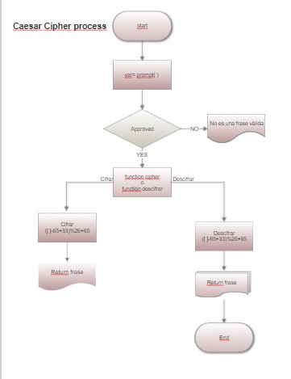

#Pseudocódigo
1.	Crear una web que por un prompt( ) obtenga una frase
2.	Contener dos funciones cipher y decipher
      2.1	Cifrar desplazando 33 hacia la derecha por medio de ([ ]-65+33)%26+65
       2.2	Descifrar regresando 33 espacios por medio de ([ ]-65+33)%26+65
3.	No aceptar campos vacíos ni números
4.	Cifrar tanto mayúsculas como minúsculas
5.	Descifrar el código

