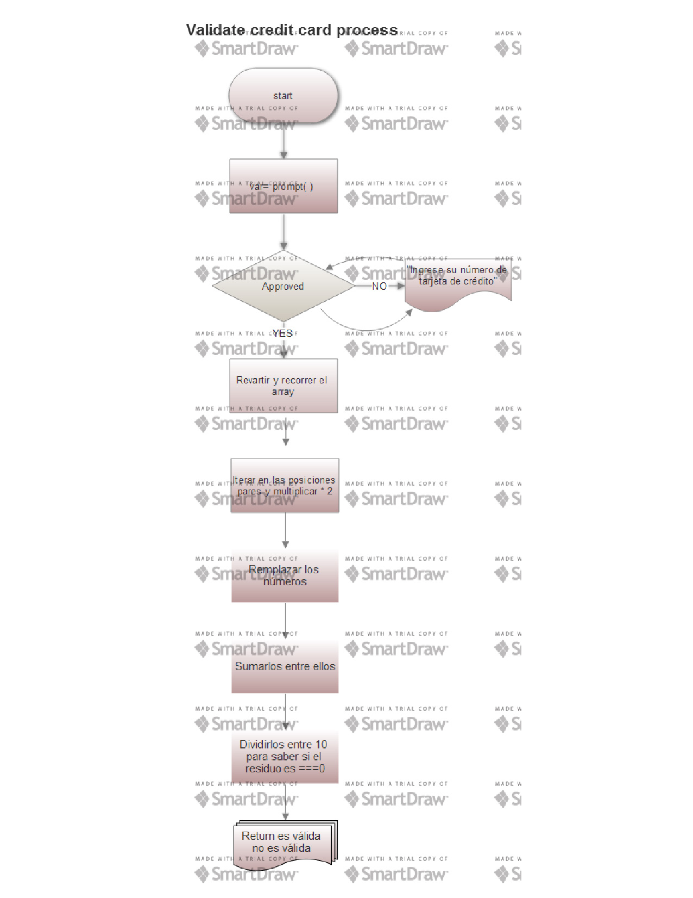

#Pseudocódigo

1.	Crear web que por un prompt( ) pida un número de tarjeta
2.	Función isValidCard que guarde los datos en un array
3.	Revertir y recorrer el array
4.	Obtener los números en posición par y multiplicarlos por 2
4.1 Si el resultado es de dos dígitos sumarlos entre ellos y remplazarlos
4.2 Si es de un dígito remplazarlo
5.	Sumar los números obtenidos
6.	Validar la tarjeta si el resultado de la suma es divisible entre 10

